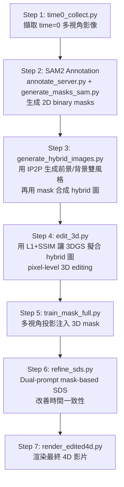

# Instruct-4DGS：Mask-Based Dual-Prompt 4D Editing 完整文件

本文件涵蓋完整的理論基礎、系統架構、Pipeline 流程、每一步的使用指令，以及故障排除。

---

## 一、理論基礎

### 1.1 原版 Instruct-4DGS Pipeline

原版論文的 4-step pipeline：

```
                        ┌────────────────────────────────┐
       InstructPix2Pix  │  multiview_edit.py             │
          2D editing    │  對 time=0 多視角影像生成       │
                        │  edited 2D images              │
                        └────────────┬───────────────────┘
                                     │ edited images (GT)
                        ┌────────────▼───────────────────┐
          3D fitting    │  edit_3d.py                     │
       (L1 + SSIM)      │  用 pixel-level loss 讓 3DGS   │
                        │  擬合 edited images             │
                        └────────────┬───────────────────┘
                                     │ point_cloud.ply
                        ┌────────────▼───────────────────┐
       SDS Refinement   │  refine_sds.py                 │
       (temporal        │  用 SDS loss 改善              │
        consistency)    │  時間軸上的一致性               │
                        └────────────┬───────────────────┘
                                     │ refined point_cloud.ply
                        ┌────────────▼───────────────────┐
          Render        │  render_edited4d.py             │
                        │  渲染最終 4D 影片               │
                        └────────────────────────────────┘
```

**原版的限制**：只支援單一 prompt 全域編輯，無法針對前景（人物）和背景分別使用不同風格。

### 1.2 我們的擴充：Mask-Based Dual-Prompt Editing

我們擴充了原版系統，核心創新：

#### (A) 3D Mask 屬性

為每個 3D Gaussian 點添加 `_mask` 屬性（存入 PLY 檔案），用於標記前景/背景歸屬：

```
sigmoid(_mask) → 1.0 = 前景（人物）
sigmoid(_mask) → 0.0 = 背景
```

#### (B) Multi-Camera Mask Projection

利用 SAM2 在 2D 標註遮罩，再透過多視角相機投影交集寫入 3D 空間：

```
多視角 2D Mask  →  3D 空間投影交集  →  per-point _mask
(SAM2 output)     (train_mask_full.py)   (存入 PLY)
```

**原理**：從 N 個相機角度分別把 2D mask 投射到 3D 空間，取交集。只有在所有視角中都被標為前景的點，才會被標記為前景。這保證了 3D 空間的標記精確度。

#### (C) Spatial Gradient Blending (Multi-Conditional Score Distillation)

在 SDS refinement 階段，對前景和背景分別使用不同的 diffusion prompt，再透過 mask 在 latent space 做空間混合：

```python
# 1. UNet forward for foreground prompt
noise_pred_fg = UNet(latents_noisy, t, prompt_fg)

# 2. UNet forward for background prompt  
noise_pred_bg = UNet(latents_noisy, t, prompt_bg)

# 3. Spatial blending
noise_pred = noise_pred_fg * mask_latent + noise_pred_bg * (1 - mask_latent)
```

數學公式：

```
∇θ L_SDS = w(t) · [ε_θ(z_t; y, t) - ε]

其中 ε_θ 是空間混合後的 noise prediction：
ε_θ = M · ε_fg + (1 - M) · ε_bg

M = 從 3D mask 渲染出的 2D mask，下采樣到 latent space
```

#### (D) Background L1 Anchor Loss

為了防止背景在 SDS 優化過程中漂移，額外加入背景區域的 L1 anchor loss：

```python
loss = loss_sds + 1000.0 * L1(rendered_bg, gt_bg)
```

---

## 二、系統架構

### 2.1 完整 Pipeline（7 步驟）



### 2.2 核心腳本對照表

| 腳本 | 用途 | 輸入 | 輸出 |
|---|---|---|---|
| `time0_collect.py` | 擷取 t=0 影像 | `data/{dataset}/{scene}/cam*/images/0000.png` | `data/{dataset}/time0_{scene}/` |
| `scripts/annotate_server.py` | Web 標註工具 | time0 影像 | `masks/custom_prompts.json` |
| `scripts/generate_masks_sam.py` | SAM 生成 mask | prompts.json + time0 影像 | `masks/binary/*.png` |
| `scripts/generate_hybrid_images.py` | 雙風格混合圖 | time0 影像 + masks + prompts | `hybrid/*.png` |
| `edit_3d.py` | 3D pixel-level 編輯 | iteration_14000 PLY + hybrid 圖 | `point_cloud_3dedit/{prompt}/iteration_1000/` |
| `train_mask_full.py` | 注入 3D mask | edit_3d PLY + SAM masks | 同 PLY（原地修改） |
| `refine_sds.py` | 雙 prompt SDS refinement | edit_3d PLY (含 mask) | `point_cloud_refine/{prompt}/iteration_800/` |
| `render_edited4d.py` | 渲染 4D 影片 | refine PLY | `edited_{scene}.mp4` |

### 2.3 輸出目錄結構

```
output/{dataset}/{scene}/
├── point_cloud/
│   └── iteration_14000/          # 原始訓練結果
│       ├── point_cloud.ply
│       └── deformation.pth
├── point_cloud_3dedit/
│   └── {prompt_fg}/
│       └── iteration_1000/       # edit_3d 輸出（含 mask after train_mask_full）
│           ├── point_cloud.ply
│           ├── deformation.pth
│           ├── deformation_table.pth
│           └── deformation_accum.pth
├── point_cloud_refine/
│   └── {prompt_fg}/
│       └── iteration_800/        # refine_sds 輸出
│           ├── point_cloud.ply
│           ├── deformation.pth
│           ├── deformation_table.pth
│           └── deformation_accum.pth
└── edited_{scene}.mp4            # 最終影片
```

---

## 三、完整使用教學

### 前置條件

- 已訓練好原始 4DGS 模型（`output/{dataset}/{scene}/point_cloud/iteration_14000/` 存在）
- Conda 環境：`Gaussians4D`
- Python 路徑：`/tmp2/martinlin/miniconda3/envs/Gaussians4D/bin/python`

以下以 `coffee_martini` 場景為例。

### Step 1: 擷取 time0 影像

```bash
python time0_collect.py --dataset dynerf --scene_name coffee_martini
```

輸出：`data/dynerf/time0_coffee_martini/original_time0_*.png`

### Step 2: SAM2 遮罩標註

#### 2a. 開啟標註伺服器

```bash
/tmp2/martinlin/miniconda3/envs/Gaussians4D/bin/python \
    scripts/annotate_server.py \
    --data_dir data/dynerf/time0_coffee_martini \
    --port 8765
```

在瀏覽器開啟 `http://<server_ip>:8765`：
- **左鍵**：標記前景（人物）→ 綠色點
- **右鍵**：標記背景 → 紅色點
- 點完後按 **Save & Next**

#### 2b. 生成 binary masks

```bash
CUDA_VISIBLE_DEVICES=0 \
/tmp2/martinlin/miniconda3/envs/Gaussians4D/bin/python \
    scripts/generate_masks_sam.py \
    --data_dir data/dynerf/time0_coffee_martini \
    --prompts_json data/dynerf/time0_coffee_martini/masks/custom_prompts.json \
    --checkpoint /tmp2/martinlin/sam_checkpoints/sam_vit_h_4b8939.pth
```

輸出：`data/dynerf/time0_coffee_martini/masks/binary/*.png`

### Step 3: 生成雙風格混合圖

```bash
CUDA_VISIBLE_DEVICES=0 \
/tmp2/martinlin/miniconda3/envs/Gaussians4D/bin/python \
    scripts/generate_hybrid_images.py \
    --data_dir data/dynerf/time0_coffee_martini \
    --prompt_fg "Turn him into a Van Gogh painting" \
    --prompt_bg "Make it look like a fauvism painting" \
    --guidance_scale 7.5 \
    --image_guidance_scale 1.5
```

輸出：`data/dynerf/time0_coffee_martini/hybrid/*.png`

> **原理**：分別用 InstructPix2Pix 生成前景風格和背景風格的 2D 圖，再用 binary mask 縫合成 hybrid 圖：  
> `I_hybrid = I_fg × mask + I_bg × (1 - mask)`

### Step 4: 3D Editing（pixel-level 擬合）

```bash
CUDA_VISIBLE_DEVICES=0 python edit_3d.py \
    --configs "./arguments/dynerf/coffee_martini.py" \
    --ply_path "./output/dynerf/coffee_martini/point_cloud/iteration_14000/point_cloud.ply" \
    -s "./data/dynerf/coffee_martini" \
    --model_path "./output/dynerf/coffee_martini" \
    --dataset "dynerf" \
    --scene "coffee_martini" \
    --prompt "Turn him into a Van Gogh painting"
```

> **注意**：
> - `edit_3d.py` 內部強制 1000 iterations，不受 `--iterations` 參數影響
> - **必須**指定 `--dataset` 和 `--scene`，否則找不到 hybrid 目錄會崩潰
> - `--prompt` 只用於命名輸出目錄，實際風格來自 hybrid 圖
> - Loss = L1 + SSIM（pixel-level supervision，結果最清晰）

### Step 5: 注入 3D Mask

```bash
CUDA_VISIBLE_DEVICES=0 python train_mask_full.py \
    --configs "./arguments/dynerf/coffee_martini.py" \
    -s "./data/dynerf/coffee_martini" \
    --model_path "./output/dynerf/coffee_martini" \
    --ply_path "./output/dynerf/coffee_martini/point_cloud_3dedit/Turn him into a Van Gogh painting/iteration_1000/point_cloud.ply"
```

> **原理**：讀取 edit_3d 的 PLY → 用所有相機的 2D mask 做多視角投影 → 在 3D 空間標記 `_mask=+10`（前景）/ `_mask=-10`（背景）→ 寫回同一個 PLY

### Step 6: Dual-Prompt SDS Refinement

```bash
CUDA_VISIBLE_DEVICES=0 python refine_sds.py \
    --configs "./arguments/dynerf/coffee_martini.py" \
    --ply_path "./output/dynerf/coffee_martini/point_cloud_3dedit/Turn him into a Van Gogh painting/iteration_1000/point_cloud.ply" \
    -s "./data/dynerf/coffee_martini" \
    --model_path "./output/dynerf/coffee_martini" \
    --prompt_fg "Turn him into a Van Gogh painting" \
    --prompt_bg "Make it look like a fauvism painting" \
    --guidance_scale 10.5 \
    --image_guidance_scale 1.2
```

> **參數說明**：
> - `--prompt_fg`：前景（人物）的編輯指令
> - `--prompt_bg`：背景的編輯指令（設為 `"none"` 則背景不受 SDS 影響，只有 L1 anchor 保持原樣）
> - `--guidance_scale`：SDS guidance 強度（建議 7.5~12.5，越高越強但可能更模糊）
> - `--image_guidance_scale`：image conditioning 強度（建議 1.0~1.5）

> **SDS 的已知限制**：SDS loss 天生有 over-smoothing 的問題，結果會比 edit_3d 稍微模糊。這是正常的，SDS 的目標是改善**時間一致性**而非清晰度。

### Step 7: 渲染最終影片

```bash
CUDA_VISIBLE_DEVICES=0 python render_edited4d.py \
    --configs "./arguments/dynerf/coffee_martini.py" \
    --model_path "./output/dynerf/coffee_martini" \
    --ply_path "./output/dynerf/coffee_martini/point_cloud_refine/Turn him into a Van Gogh painting/iteration_800/point_cloud.ply"
```

輸出：`output/dynerf/coffee_martini/edited_coffee_martini.mp4`

> **Deformation 載入**：`render_edited4d.py` 會自動從 `--ply_path` 同目錄讀取 `deformation.pth`，不再 hardcode `iteration_14000`。

---

## 四、一鍵執行（Pipeline Script）

```bash
bash run_instruct4dgs_mask.sh dynerf coffee_martini \
    "Turn him into a Van Gogh painting" \
    7.5 1.5 \
    "Make it look like a fauvism painting"
```

參數順序：`<dataset> <scene> <prompt_fg> <guidance_scale> <image_guidance_scale> [prompt_bg]`

> 注意：Step 2（SAM 標註）需要手動操作，script 會暫停等你完成。

---

## 五、各 Loss 對照

| Loss | 使用位置 | 作用 |
|---|---|---|
| **L1 + SSIM** | `edit_3d.py` | Pixel-level 擬合 hybrid 圖，結果最清晰 |
| **SDS** (Score Distillation Sampling) | `refine_sds.py` | 用 diffusion prior 引導，改善時間一致性 |
| **Background L1 Anchor** | `refine_sds.py` | 鎖定背景，防止 SDS 過程中背景漂移 |
| **TV Regularization** | `refine_sds.py` | 時間平滑正則化，減少閃爍 |

---

## 六、故障排除

### Q: `edit_3d.py` 結果不錯但 `refine_sds.py` 很模糊？

**正常現象**。SDS loss 的固有限制（mode-seeking / over-smoothing）。
- 可降低 `--guidance_scale`（例如 7.5 而非 10.5）
- SDS 的目標是時間一致性，不是提高清晰度

### Q: `fully_edit_sds.py` 結果完全模糊？

**已知 Bug（已修正）**：原本 `fully_edit_sds.py` 第 322 行把**乾淨的 latents** 餵給 UNet，而不是 **noisy latents**。
SDS 要求 UNet 在 timestep t 預測 noise，必須接收加噪後的 input。已修正為 `latents_noisy`。

### Q: `render_edited4d.py` 渲染結果跟 edit_3d 不同？

之前 `render_edited4d.py` hardcode 從 `iteration_14000` 讀取 deformation。已修正為從 `--ply_path` 同目錄讀取。

### Q: `train_mask_full.py` 報錯找不到路徑？

已參數化，現在必須傳入 `--ply_path` 指定要注入 mask 的 PLY 檔案路徑。

### Q: `prompt_bg` 設為 `"none"` 時背景會怎樣？

背景的 SDS gradient 會被設為 0（`noise_pred_bg = noise`，所以 `grad = w * (noise - noise) = 0`）。  
背景只受 L1 anchor loss 約束，保持原始外觀。

---

## 七、腳本修改記錄

### `refine_sds.py`（核心擴充）
- ✅ `--prompt` → `--prompt_fg` + `--prompt_bg`
- ✅ 每個 iteration 渲染 2D mask（從 `_mask` 屬性 + differentiable rendering）
- ✅ Mask 下采樣到 latent space 並 binarize
- ✅ 分別對 fg/bg prompt 做 UNet forward
- ✅ Spatial blending：`noise_pred = fg * mask + bg * (1 - mask)`
- ✅ 修正 SDS bug：`latents` → `latents_noisy`（UNet 必須接收 noisy input）
- ✅ 加入 Background L1 Anchor Loss
- ✅ 重新啟用 Time Smoothness Regularization (TV loss)
- ✅ Deformation 從 `ply_path` 同目錄讀取（不再 hardcode `iteration_14000`）

### `render_edited4d.py`
- ✅ 修正 deformation 載入路徑：從 `--ply_path` 同目錄自動讀取

### `train_mask_full.py`
- ✅ 參數化 `--ply_path`（原本 hardcoded 路徑）

### `run_instruct4dgs_mask.sh`（新增）
- ✅ 完整 7-step pipeline script，支援 dual-prompt

### `fully_edit_sds.py`（Bug 修正）
- ✅ 修正第 322 行 `latents` → `latents_noisy`（SDS 的致命 bug）
